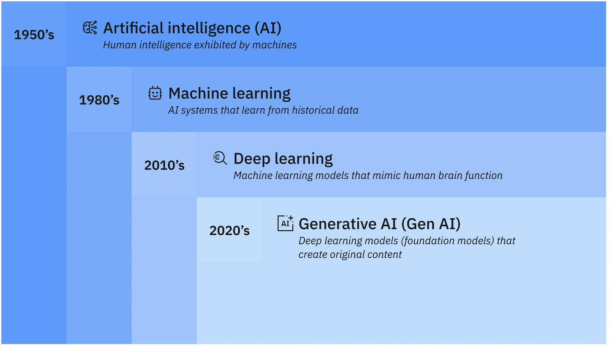

# **What is Artificial Intelligence (AI)?**
- **Artificial Intelligence (AI)** is the development of computer systems capable of performing tasks that typically require human intelligence.
- This includes activities like learning, reasoning, problem-solving, understanding language, and generating new content.
- Instead of following strict, pre-written rules, AI learns from massive amounts of data to identify patterns and make predictions.
- Applications and devices equipped with AI can see and identify objects. They can understand and respond to human language. They can learn from new information and experience. They can make detailed recommendations to users and experts.
- They can act independently, replacing the need for human intelligence or intervention (a classic example being a self-driving car).

# **Key Concepts and Types of AI**
- <b>Machine Learning</b>: A subset of AI where computers learn from historical data to improve their performance over time without being explicitly programmed.
    - It means allowing computers to learn from data without being explicitly programmed.
    - Popular examples include <b>Netflix's recommendation engines</b>, <b>smartphone Face ID</b>, <b>Google Maps traffic predictions</b>, and <b>automated email spam filters</b>.
- <b>Generative AI</b>: A type of AI that learns patterns from data to create entirely new content, such as text, images, or code.
- <b>Natural Language Processing (NLP)</b>: Technology that allows machines to read, understand, and communicate in human language (e.g., virtual assistants like Siri or Google Assistant).

# **Machine Learning (ML)**
- A simple way to think about AI is as a series of nested or derivative concepts that have emerged over more than 70 years:

- Involves creating models by training an algorithm to make predictions or decisions based on data.